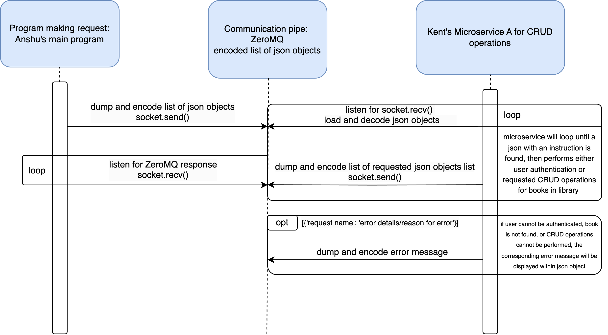

# Anshu-Microservice-A
Microservice to run operations for Anshu's main program

Microservice access instructions:
Anshu’s main program needs Kent’s Microservice-A to do the following:
Receive:
● A list through ZeroMQ
● Within the list, there will be JSON objects representing the necessary data for the
operation (e.g., book details, member information) alongside variables that specify
which operation is being requested.
● Indicating the CRUD operation to be executed, as specified by the main program.

Operations:
[{'delete_book_id': True}, book_id]
- Performs operations to delete the specified book by book id.

[{'delete_all_books': True}, None]
- Performs operations to delete all items from the database or stored list.

[{'borrow_book': True}, book_id}]
- Perform operations to borrow the specific book.

[{'return_book': True}, book_id}]
- Perform operations to borrow the specific book.

[{'sign_up': True}, {'username': 'John_Doe, 'password': 'password123', 'email':
'user@example.com', 'id': 4}]
- Perform the operations to add a new member to the library system with a
username, password, and email.

[{'sign_in': True}, {'username': 'existing_user', 'password': 'password123'}]
- Perform the operations to authenticate an existing member by verifying their
username and password.

[{'delete_user_id’: True}, user_id]
- Perform the operations to delete the specified user.

[{'key1': 'valueA', 'key2': 'valueB', ..., 'id': int}]
- Perform operation to the storage of a new message represented by the
provided JSON object.

[{'store_book': True}, {'title': 'New Book', 'author': 'Author Name', 'id': 4, 'isbn': 'ISBN004',
'available': True}]
- Perform operation to store the new book's JSON object to the local list.

Return:
● The system can be designed to store and retrieve data objects (such as books or
members) in a list format. When a request is received via ZeroMQ, the system will return
the complete list of all stored JSON objects.
	

UML Sequence Diagram:

Microservice mitigation plan:
	Teammate name for microservice implementation:
Anshu Avinash

Current status of microservice:
Complete

Access program:
Download a copy of Python code via GitHub: https://github.com/tolzmank/Anshu-Microservice-A
Run locally

	Access issues contingencies:
If teammate is unable to access or call my microservice, I will be available to answer questions/help them via text message. I am available anytime between 7:00am - 8:00pm HST.
Teammate must let me know of any access issues before 8:00pm HST on the due date of the assignment.

Other considerations/assumptions:
Teammate can run python code on their machine.
Teammate has zmq and json modules installed on their code editor. My program will be importing them.
Note that [{'delete_all_books': True}, None] must have a second item in the list, it doesn’t matter what the item is, but all the book operations except for delete_all_books have some sort of a second item, so the way I have my code setup is that it defines that second item before calling a helper function. So it will throw an error if there is not a second item, since it will be trying to access data[1]. So I have None as a placeholder for this.
	This doesn’t apply for the create message function, because it does not use a helper function.

